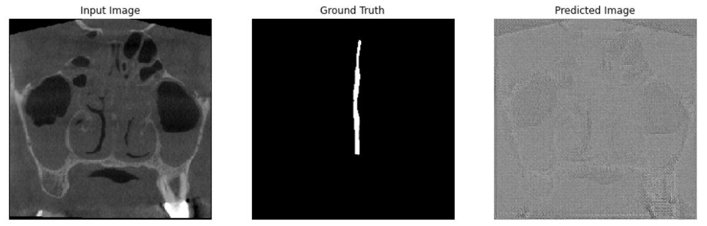
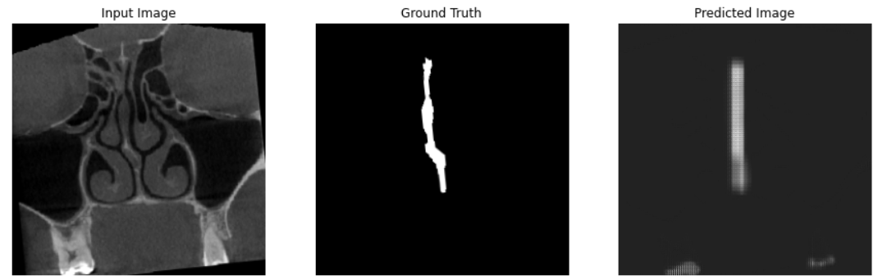
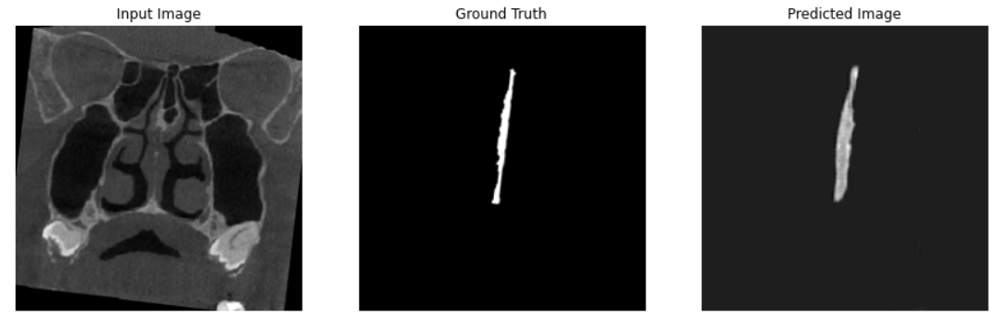
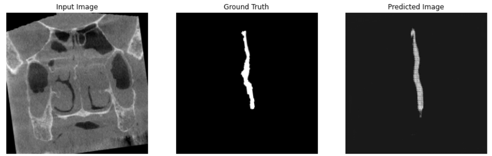

#SeptumMobileNetSegmentationGAN

This repository contains notebook used to train neural network for the project of calculating nasal septum deviation. 
In the notebook explored GAN approach for training a neural network fo nasal septum segmentation.
As a backbone of GAN used MobileNetV2.

The main instruments used are TensorFlow and Google Colab.

Images of septum are sices of 3D DICOM computer tomography scans. 
Predicted examples during training:
1) Epoch 0:
    
   <
2) Epoch 5:
     
   <
3) Epoch 20:
     
   <
4) Epoch 50:
     
   <
